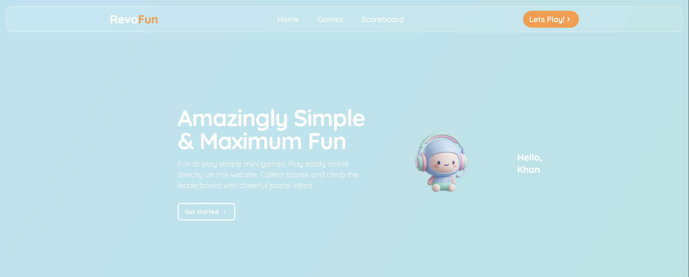
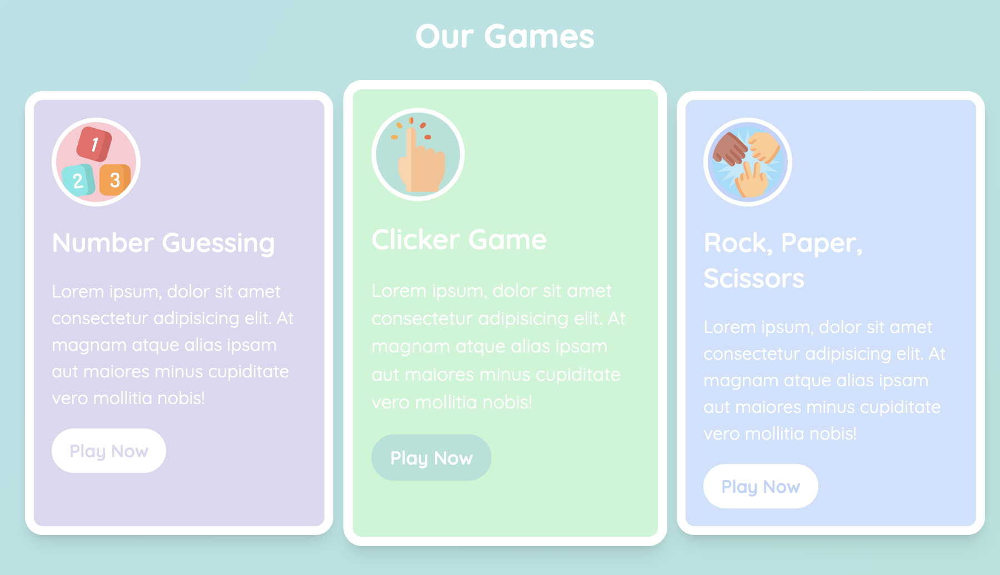
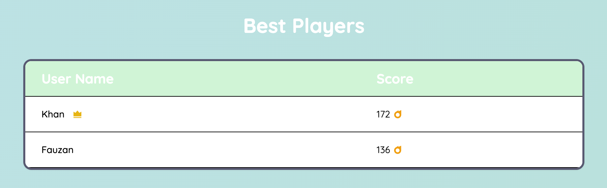
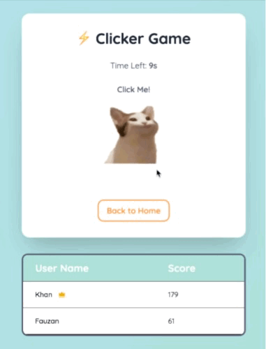

[](https://classroom.github.com/a/PAiQDgnZ)

# RevoFun — Gaming Company Landing Page

Demo Link: [Open](https://revou-fsse-oct25.github.io/milestone-2-khankhanfauzan/)
Repository Link: [Open](https://github.com/Revou-FSSE-Oct25/milestone-2-khankhanfauzan)

## Overview

-   RevoFun is a pastel-themed gaming landing page featuring three mini-games playable directly in the browser: Number Guessing, Clicker, and Rock–Paper–Scissors.
-   Users enter a username once; scores for each game are persisted in `localStorage` and shown in the leaderboard (total and per game).
-   Fully responsive layout with a mobile navigation overlay, a username modal, and dynamic UI components.

## Features

-   Landing page sections: Welcome, Values & Vision, Company Members, Games, and Scoreboard.
-   Username modal to associate scores with a user.
-   Mini-games:
    -   Number Guessing: guess 1–100, high/low feedback, points based on remaining attempts.
    -   Clicker: click for 10 seconds, random click sound effects, final score display.
    -   Rock–Paper–Scissors: winner calculation refactored with `switch`, styled result messages.
-   Scoreboard:
    -   Total score across all games on the home page.
    -   Per-game scoreboard on each game page.
-   Mobile navigation overlay with toggle and close behaviors.

## Technologies Used

-   HTML5 and CSS (Tailwind via CDN) with custom CSS variables in `style.css`.
-   Vanilla JavaScript for game logic and DOM manipulation.
-   Client-side persistence via `localStorage` in `src/storage.js`.
-   Icons: Remix Icon. Fonts: Google Fonts (Quicksand).

## Getting Started (Local)

-   Open `index.html` directly in the browser or run via a static file server.
-   Game pages:
    -   `games/number_guessing.html`
    -   `games/clicker.html`
    -   `games/rock_paper_scissors.html`
-   JavaScript entry points:
    -   `src/main.js` (navigation, modal, total leaderboard)
    -   `src/storage.js` (localStorage helpers, shared scoreboard row util)
    -   `src/games/*.js` (game-specific logic)

## Deployment

-   GitHub Pages
    -   Make the repository public.
    -   Go to `Settings` → `Pages` → `Source: Deploy from a branch`.
    -   Choose branch `main` and folder `/(root)`.
    -   Save and use the generated Pages URL.
-   Netlify
    -   Create a new site connected to your GitHub repo or drag-and-drop the project folder.
    -   No build command needed; set the publish directory to the project root.
    -   Copy the site URL after deployment.

## Folder Structure

```
.
├─ index.html
├─ style.css
├─ README.md
├─ .gitignore
├─ assets/
│  ├─ audios/
│  │  ├─ pop1.ogg
│  │  ├─ pop2.ogg
│  │  ├─ pop3.ogg
│  │  └─ pop4.ogg
│  ├─ gifs/
│  │  ├─ clicker_game_demo.gif
│  │  ├─ number_guessing_game_demo.gif
│  │  └─ rps_game_demo.gif
│  ├─ images/
│  │  ├─ hero-image.png
│  │  ├─ clicker.png
│  │  ├─ numbers.png
│  │  ├─ rock-paper-scissors.png
│  │  ├─ cat.png
│  │  └─ cat-open.png
│  └─ screenshots/
│     ├─ welcome.png
│     ├─ games.png
│     ├─ scoreboard.png
│     ├─ number_guessing_game.png
│     └─ rock_paper_scissors_game.png
├─ games/
│  ├─ clicker.html
│  ├─ number_guessing.html
│  └─ rock_paper_scissors.html
└─ src/
   ├─ main.js
   ├─ storage.js
   └─ games/
      ├─ clicker.js
      ├─ number_guessing.js
      └─ rock_paper_scissors.js
```

## Screenshots / Demo

-   Home: 
-   Games: 
-   Scoreboard: 

-   Demo:
-   Clicker Game 
-   Rock, Paper, Scissors Game 
-   Number Guessing Game 
